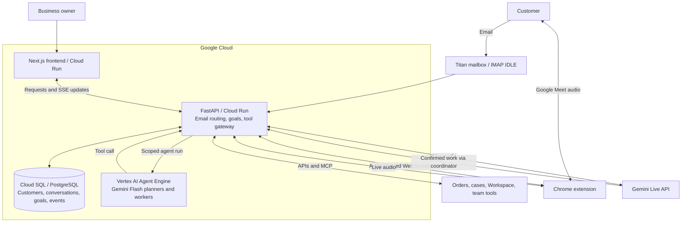

<p>
  <a href="https://nextjs.org/"></a>
  <a href="https://fastapi.tiangolo.com/"></a>
  <a href="https://google.github.io/adk-docs/"></a>
  <a href="https://ai.google.dev/"></a>
  <a href="https://ai.google.dev/gemini-api/docs/live"></a>
  <a href="https://cloud.google.com/"></a>
</p>

# Front Desk

Front Desk is an AI customer agent that connects customers with the people, information, and systems inside a business. It handles inquiries, maintains context for each customer, carries out work in connected applications, and asks for a human decision when needed. Customers can communicate by email or through a Google Meet call while Front Desk investigates and works on their request.

The product comes from running Aqualabs, a startup working with fish and aquaculture in Kenya. As the customer base grows, more time goes into finding previous conversations, checking orders, asking colleagues what happened, and making sure a promised action was completed. The information exists, but it is spread across the business. Front Desk keeps the customer relationship connected to that work.

[Open Front Desk](https://front-desk-web-q3shbtjl3a-uc.a.run.app) · [Source repository](https://github.com/victorbash400/Frontdesk)

## What Front Desk does

### Maintains a continuing customer record

Each customer has a profile, documents, conversation history, and associated goals. Incoming email is matched to a canonical customer identity. The Email Agent reads the existing profile and relevant work before updating a concise summary of confirmed facts, preferences, problems, and commitments.

A returning customer can continue an unresolved request without creating a separate case every time they reply. Staff can inspect the same customer record and see what is running, what has finished, and what needs their attention.

### Turns customer requests into work

New mail arrives through a connected Titan mailbox using IMAP IDLE. Front Desk files the message, updates customer context, and decides whether to record it, resume an existing goal, create a new goal, or request attention. A thank-you message does not automatically become a task. A reply with missing order details can continue the work that was waiting for it.

Goals contain persistent assignments, dependencies, progress, questions, and results. A worker can use several connected systems to complete one customer outcome. Work can also start from the business owner's request in the Goals interface, and goals support scheduled follow-up instructions. The client voice interface can discuss existing goals and surface questions.

### Works in business applications

Front Desk loads the capabilities needed for each assignment. The implemented integration paths include:

| Connection | Work it supports |
| --- | --- |
| Aqualabs Store MCP | Look up customers, catalog items, orders, and support cases; create or update orders and case records through the store's tools. |
| Titan Mail | Receive customer email, send messages, and reply within the customer thread attached to a goal. |
| Google Workspace | Gmail, Drive search, Google Docs, Calendar, Meet, and permission-controlled requests to supported Google APIs. |
| Atlassian | Investigate and update Jira and Confluence through its connected MCP service. |
| Slack | Read or post relevant internal updates when required by the assignment and connection permissions. |
| GitHub and Vercel | Investigate connected repositories, issues, and deployments when a customer problem requires technical work. |
| Browser Use | Operate websites through the user's connected Chrome profile. |

Connections must be configured and authorized. A plugin appearing in the directory does not mean its provider is connected. The Aqualabs Store connector points to a separate application and uses deployment-level credentials; it is not a general inventory or payment service bundled into Front Desk.

### Conducts customer calls while work runs

Front Desk can create a Meet space, email the link to the verified customer, join the meeting, and wait for the participant. A dedicated Gemini Live agent receives the customer profile and the purpose of the call. It can listen, respond, handle interruption, and ask the customer for clarification or confirmation.

Application work runs separately. The voice agent prepares a bounded action, asks the customer to confirm it, and dispatches it after confirmation. A coordinator plans the assignment and returns its progress and result to the conversation. In the current meeting implementation, these delegated application tasks are restricted to Aqualabs Store.

The call uses the Chrome extension and the macOS Agent Mike and Agent Ears audio devices. It is a Google Meet workflow, not telephone-network calling. English and Swahili are among the selectable spoken languages.

### Keeps staff involved where needed

Unclear identity, missing information, failures, and decisions can be exposed as questions or attention items. Answers can resume the associated assignment. The goal board preserves the current situation so staff can act with context instead of reconstructing the case from separate messages.

## How Front Desk works



The Email Agent handles intake and routing. The goal planner maintains the task plan. Goal workers execute bounded assignments. The meeting agent handles conversation. These roles share persisted customer and goal identifiers without sharing an unrestricted tool surface.

Cloud Run owns the authenticated tools and application state. Agent Engine receives each run's instructions, model configuration, and selected tool declarations through a scoped manifest. Tool calls return to the Cloud Run gateway, which validates the run and executes the corresponding implementation. This preserves the same agent definitions in local and managed execution.

PostgreSQL notifications deliver updates across backend instances, and server-sent events update the frontend. The browser relay also routes between instances through shared records and notifications. Browser control remains tied to the connected Chrome session.

## Models and runtime

| Role | Configuration |
| --- | --- |
| Email, planning, goals, and supervision | `gemini-3.6-flash` on Vertex AI. |
| Live voice and customer meetings | `gemini-3.1-flash-live-preview` through the Gemini Live API. A Gemini API key is required for this path. |
| Agent framework | Google ADK; Google Gen AI SDK for live audio and title generation. |

Planning and email routing use low thinking settings; goal workers use medium; live conversation uses minimal. Tools load on demand rather than placing every provider's schema in each request. These choices reduce unnecessary work and keep slow application operations outside the live conversation. End-to-end latency and concurrent-customer capacity have not been benchmarked.

## Google Cloud deployment

The inspected deployment uses project `front-desk-20260824` and Cloud Run services `front-desk-web` and `front-desk-api` in `us-central1`. The API revision `front-desk-api-00040-lec` was receiving all API traffic on August 31, 2026. Its configured Agent Engine resource is:

```text
projects/222990066722/locations/us-central1/reasoningEngines/7505923329396572160
```

The frontend, backend, and Agent Engine runtime have separate deployment packages. Source staging excludes local databases, credentials, screenshots, and unrelated workspace files. See [deployment instructions](infra/README.md), [backend staging](infra/stage_backend.py), [frontend staging](infra/stage_frontend.py), and [Agent Engine deployment](infra/deploy_agent_engine.py).

The API is capped at two Cloud Run instances with CPU throttling disabled for background work. Database connection pools and ownership leases have explicit budgets. Increasing capacity requires coordinated database sizing, model quotas, and browser/call resource management; Cloud Run autoscaling alone does not establish those capacities.

## Customer data and execution boundaries

Application records and provider connections are scoped to an account. Customer profiles are stored documents that staff can inspect and edit. Conversation records, operational task state, and ADK session history remain separate. The customer-memory path described here does not depend on a vector database or Vertex AI Memory Bank.

Provider tokens and mailbox passwords are encrypted in application storage using a key derived from the backend internal secret. Production secrets are supplied through Secret Manager. Agent tool runs have expiring credentials and a permitted tool set; meeting tickets bind the account, meeting, runtime, and browser bridge.

Interrupted goals retain their records but are paused on backend restart. The runtime does not blindly replay external work during startup. Selected application actions may already have happened, so resuming must use their recorded state. A live call is limited to one active meeting runtime per account.

These are implementation boundaries, not a claim of certified enterprise compliance. Department-level roles, tenant-specific managed-store credentials, and formal retention and audit policies are further product work.

## Local setup

Use Node.js 22 or newer, pnpm, Python 3.14, the Google Cloud CLI, and a Google Cloud project with billing and Vertex AI access. Python 3.14 is required for the mailbox listener's `IMAP4.idle()` support. Browser Use needs Chrome and the extension; customer calls additionally need the macOS audio drivers.

### Install dependencies

```sh
git clone https://github.com/victorbash400/Frontdesk.git
cd Frontdesk
pnpm install --frozen-lockfile
python3.14 -m venv backend/.venv
backend/.venv/bin/python -m pip install -r backend/requirements-dev.txt
cp .env.example .env.local
cp backend/.env.example backend/.env
```

For an existing checkout, retain its environment files instead of overwriting them.

### Configure the application

Set `AUTH_SECRET` in `.env.local` to a strong random value. Set `FRONT_DESK_INTERNAL_SECRET` to the same independently generated value in both `.env.local` and `backend/.env`. Leave the frontend backend URL as `http://127.0.0.1:8000` for a fully local run.

In `backend/.env`:

- Replace `FRONT_DESK_GOOGLE_CLOUD_PROJECT` with your project and keep `FRONT_DESK_GOOGLE_CLOUD_LOCATION=global` for the configured Flash model.
- Configure `FRONT_DESK_GEMINI_MODEL`, `FRONT_DESK_GEMINI_TITLE_MODEL`, and `FRONT_DESK_GEMINI_VOICE_MODEL` using the defaults in `backend/.env.example` or models available to your Google Cloud project.
- Remove the two example database URL lines to use the repository-local SQLite defaults, or replace their placeholder paths with real absolute paths. Do not use `/absolute/path/to/...` literally.
- Leave `FRONT_DESK_AGENT_ENGINE_RESOURCE` unset for local ADK execution. Set it only when connecting to a deployed Agent Engine resource with an HTTPS tool gateway.
- Add `FRONT_DESK_GEMINI_API_KEY` to enable live voice. Text agents authenticate to Vertex AI separately.
- Remove the placeholder `FRONT_DESK_GOOGLE_CLIENT_CREDENTIALS_FILE` until you have an OAuth web-client JSON file. Workspace features require that file or an actual client ID and secret.

Authenticate the local Vertex AI client:

```sh
gcloud auth application-default login
gcloud auth application-default set-quota-project YOUR_PROJECT_ID
gcloud services enable aiplatform.googleapis.com --project=YOUR_PROJECT_ID
```

### Start the application

Run each command in its own terminal from the repository root:

```sh
pnpm backend
```

```sh
pnpm dev
```

Open `http://localhost:3000`. The seeded demo account is `demo@front-desk.local` with password `front-desk-demo`. Use a separate account for real customer work; the demo identity is intended for evaluation.

### Connect the services required by your workflow

Connect Titan Mail from the email workspace. Connect Google Workspace and any external providers from Plugins; an installed plugin still needs a valid connection. For Google OAuth, authorize the callback `http://127.0.0.1:8000/oauth/google/callback` in local development and the API's HTTPS equivalent in production. Enable the Google APIs needed by your workflow. Provider-specific client settings are listed in [backend/.env.example](backend/.env.example).

For the Aqualabs example, set `FRONT_DESK_AQUALABS_STORE_MCP_URL` and `FRONT_DESK_AQUALABS_STORE_MCP_TOKEN` to an authorized store endpoint. A fresh clone has no access to the business's credentials or records.

Build Browser Use with `pnpm extension:build`, then load `extension/dist` using Chrome's **Load unpacked** control. Disable the upstream Playwright extension in that profile because the fork retains its extension identity. The hosted app also distributes the extension at `/extension`.

For Meet audio, install Xcode and build the two native devices with the repository's [Agent Mike installer](native/agent-mike/scripts/install.sh) and [Agent Ears installer](native/agent-ears/scripts/install.sh):

```sh
./native/agent-mike/scripts/install.sh
./native/agent-ears/scripts/install.sh
```

These installers require macOS administrator privileges and restart Core Audio, interrupting current audio sessions. Run them outside a call. Keep Front Desk open in the same Chrome profile, allow the required browser permissions, and verify both named devices before attempting a customer call. The extension ZIP does not install these drivers.

## Testing and demonstration

```sh
pnpm backend:test
pnpm lint
pnpm build
pnpm extension:typecheck
```

For a representative demonstration, use a dedicated test customer and order. Send an inquiry to the connected mailbox, show its customer profile and goal, then show the worker reading or changing the actual order through the connected store. Reply to the same thread and verify that the original goal continues. For a call, show the customer joining Meet, confirming the requested action, and hearing the observed result. Finally, show the matching backend revision in Cloud Run and its logs. Do not expose real customer records or secrets in recordings.

Read-only hosted smoke checks are documented in [infra/README.md](infra/README.md). Neither a health response nor the automated suite proves email delivery, a connected browser session, or two-way Meet audio; those require separate integration checks.

## Repository structure

| Path | Purpose |
| --- | --- |
| `app/` | Next.js customer workspace, email, goals, plugin UI, and API proxies. |
| `backend/agents/` | Customer supervision, email routing, goal planning, and meeting instructions. |
| `backend/app/` | Persistence, mail listener, task runtime, streaming, authentication, and tool gateway. |
| `backend/tools/` | Client context, business connectors, and dynamic tool loading. |
| `backend/meetings/` | Meet lifecycle, live audio sessions, participant events, and delegated call work. |
| `agent_runtime/` | Standalone Google ADK runtime deployed to Agent Engine. |
| `extension/` | Chrome browser and meeting bridge, derived from Playwright. |
| `native/` | macOS audio drivers derived from Apple's audio-server sample. |
| `infra/` | Allowlisted deployment staging and release checks. |
| `backend/tests/` | Automated backend and boundary tests. |

## Business use and licensing direction

For a small business, Front Desk is intended to reduce the staff time spent reconstructing customer history and carrying requests between applications. For larger teams, the same approach can support continuity across departments, subject to stronger access controls and deployment capacity.

The commercial direction is a hosted service for smaller businesses and licensed deployments for organizations that need their own connectors, procedures, and infrastructure. Organization skills separate business procedures from the shared runtime. Subscription billing, self-service tenant provisioning, and enterprise administration are not implemented offerings yet. Commercial terms would need to preserve the licenses of included third-party components.

The interface and voice/task design draw on my earlier Operator and Sherpa work. The browser extension is derived from Playwright and retains its Apache-2.0 license; the native audio components retain Apple's sample-code license. See their directories for attribution and terms.
